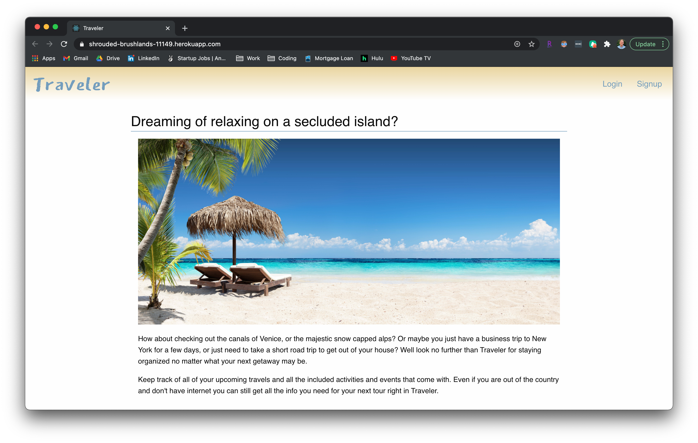
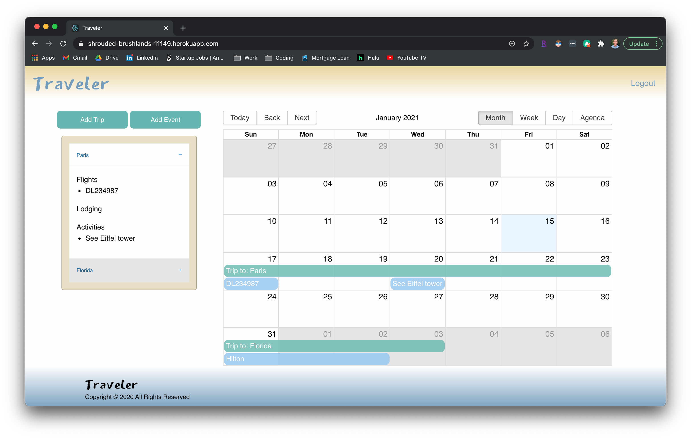

# Traveler

## Make your travel simple with all the info you need in one place.
<hr>

  [](https://github.com/tdmoore004)
  [](https://github.com/tdmoore004/traveler)
  [](https://github.com/tdmoore004/traveler)
  [](https://choosealicense.com/licenses/mit/)
  [](https://nodejs.org/en/)
  [](https://www.npmjs.com/package/inquirer)

  ## Table of Content
  * [ Project Links ](#Project-Links)
  * [ Screenshots-Demo ](#Screenshots-Demo)
  * [ Project Objective ](#Project-Objective)
  * [ User Story ](#User-Story)
  * [ Technologies ](#Technologies)
  * [ Installation ](#Installation)
  * [ Usage ](#Usage)
  * [ Credits and Reference ](#Credits-and-Reference)
  * [ Tests ](#Tests)
  * [ Author Contact ](#Author-Contact)
  * [ License ](#License)
  #

  ##  Project Links

  ##### Deployed site on heroku: https://shrouded-brushlands-11149.herokuapp.com/
  
  ##### Github REPO link:  https://github.com/tdmoore004/traveler

  ## Screenshots-Demo
  <kbd></kbd>
  <kbd></kbd>
  
  ## Project Objective
  * To create a one stop location for storing and accessing all of the necessary information for your travels. Whether it be flight number, hotel information or tour details you can store everything in Traveler for easy access. 
  * It uses React, Foundation CSS framework and jQuery lirary for the front-end.
  * It utilizes node.js, express.js, express-session, bcryptjs, passport, passport-local strategy, and mongoose for the back-end. 
  * It features a mobile-first, clean and polished user interface and adapts to multiple screen sizes.
  
  ## User Story
  As an avid traveler, I want to be able to store all of my necessary travel information for flights, lodging and activities, so that I can focus on enjoying my travels and not have to take time to look in multiple places for any information I may need. I want to be able to add information for my flights both to and from my destination as well as any details for my lodging once I arrive as well as the activities that I am participating in; I want to have easy access to this information both before and during my trip, even if I may not have an internet connection. 


  ## Technologies 
  ```
  node.js, react-big-calendar, react-date-picker, express.js, express-session, bcryptjs, passport, passport-local strategy,
  ```
  ```
  mongoose, mysql2, react, Foundation CSS, jQuery and heroku. 
  ```
  
  ## Installation
  Access to GitHub.com and a code editor such as vscode is necessary. Click the GitHub link provided above to the APP REPO. Click on the green button that says Clone or Download and Choose how you would like to download: using the SSH/HTTPS keys or download the zip file. If using SSH/HTTPS Key: You will copy the link shown and open up either terminal (mac: pre-installed) or gitbash (pc: must be installed). Once the application is open, you will type git clone paste url here. If using Download ZIP: Click on Download Zip. Locate the file and double click it to unzip the file. Locate the unzipped folder and open it. 

  ## Usage 
  There are two ways your can run this APP. One is to go to [the deployed site](https://glacial-gorge-49813.herokuapp.com/). Another is to run it on your local machine through a localhost PORT. First, you need terminal (mac: pre-installed) or gitbash (pc: must be installed). You also need to download and install [node.js](https://nodejs.org/en/) and [npm](www.npmjs.com) or [yarn](https://yarnpkg.com/) package manager. Open the cloned REPO in your favorite code editor, and then in terminal, enter the command “ npm i “ or “yarn add”  to install the dependencies. Make sure to create a .env file on the project root, and input your own Mysql Workbench config information (see the root file .env_example for samples). Now you are ready to start using  the app by entering “npm start” on your terminal or gitbash. 

  
  ## Credits and Reference
  The following links have helped us with this project. <br> [express-sessioon](https://www.npmjs.com/package/express-session) <br>  [Passport](http://www.passportjs.org/) <br>  [bcrypt](https://www.npmjs.com/package/bcryptjs) <br>  [How do sessions work in Express.js with Node.js?](https://stackoverflow.com/questions/5522020/how-do-sessions-work-in-express-js-with-node-js) <br> [sequelize](https://sequelize.org/master/index.html)  <br> [Foundation CSS Framework](https://get.foundation/) <br> [Mockaroo Data Generator](https://mockaroo.com/) <br> [Rover](https://www.rover.com/account/profile/details/)


  ## Challenges and Progress
  * Time constrain was one of the biggest challenges. Four of us had less than 2 weeks (besides working full time) to complete this project, from ideation to deployment and presentation. We had to cut down on features so that we could build a functional scooter rathan than an automobile that is broken. 
  * It is first time for any of us to build something of this scale, from front-end (using express-handlebars and Foundation CSS) to server (node.js express.js) to database connection (express sequelize, mysql2), along with new tools for authentication such as passport, passort-local startegy, express-session and password hashing such as bcryptjs. Any changes including the ones that improve the APP could cause unexpected bugs and hours of our time to fix the hugs. 
  * 

  ## Author Contact
  Contact the authors with any questions!
  Github link: [jaromplewe](https://github.com/jaromplewe), [tdmoore004](https://github.com/tdmoore004)

  ## License
  This project is [MIT](https://choosealicense.com/licenses/mit/) licensed.

   Copyright © 2020 [Jarom Plewe](https://github.com/jaromplewe), [Tanner Moore](https://github.com/tdmoore004)

  <hr>
  <p align='center'><i>
  Built by <a href="https://github.com/jaromplewe"> Jarom Plewe, </a><a href="https://github.com/tdmoore004"> Tanner Moore, </a>
</i></p>

## Description
Keep track of all of your upcoming travels and all the included activities and events that come with. Even if you are out of the country and don't have internet you can still get all the info you need for your next tour right in Traveler.

## Deployment
https://shrouded-brushlands-11149.herokuapp.com/

## Built with
* MongoDB/Mongoose
* Express.js
* React.js
* Node.js

#### Other resources
* React-big-calendar
* React-date-picker

## Screenshots
#### Startup/Login Page

#### Main Page


## Lisence
This project is licensed under the MIT License - see the LICENSE.md file for details
